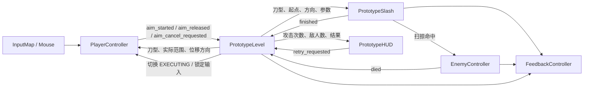

# 《狐狸骑士 / 一刀狐狸》TDD v0.1

| 文档字段 | 内容 |
| --- | --- |
| 对应设计 | `docs/GDD.md` v0.1 刀型实验 |
| 阶段 | Prototype / 核心玩法验证 |
| 文档状态 | v0.1 技术结算基线（已冻结；后续只接受缺陷修复与证据勘误） |
| 更新日期 | 2026-08-26 |
| 使用者 | Coding Agent |

## 0. 文档目的与边界

本文件说明如何用 Godot 实现 GDD v0.1，不重新解释或扩写游戏设计。发生冲突时，以 `docs/GDD.md` 为准。

只覆盖：2D 俯视单房间、狐狸移动、单种可观察的敌人移动、唯一一次攻击、以弧斩有效半径选择的远距直线位移斩与近身原地弧形斩、出刀后输入锁定、命中与死亡、固定镜头、基础反馈、胜败结算和快速重试。

不建立 Boss、成长、关卡编辑、完整世界观、复杂技能、装备、生命值、多攻击、元结构或通用内容生产框架。

本文使用以下标记处理尚未确定的设计：

> **v0.1临时实现，不代表最终设计**

临时方案必须保持局部、可替换，不得反向成为 GDD 结论。

## 1. 技术原则

- 首个工程使用 Godot 4.7 的 2D 节点和 GDScript；创建后以 `project.godot` 的 `config/features` 记录实际版本，并在开发与验收中保持一致。
- 以一个可运行、可重复开始的 Prototype 场景为交付单位。
- 采用场景组合、局部信号和少量脚本，不引入全局事件总线或复杂依赖注入。
- 当前参数优先使用 `@export` 暴露在 Inspector；不提前建设配置数据库。
- 关卡状态只有初始化、观察、瞄准、执行、结算五个阶段，由一个控制器统一管理。
- 重试直接重载当前场景，避免为 Prototype 建立持久化状态系统。
- 视觉表现与命中判定默认共用同一组斩击参数，避免“看起来命中但实际未命中”；仅允许用显式调试倍率做命中公平性对比，且必须记录测试值。

## 2. Godot 项目结构

FoxKnight 根目录已建立 `project.godot`，Codex 工作目录、项目文档目录与 Godot 的 `res://` 根目录一致。工程 `config/features` 记录 Godot 4.7 与 Forward Plus；以下 `scenes/`、`scripts/`、`assets/` 和 `tests/` 均相对于该根目录。

> 开发预检已完成：2026-08-08 使用 Godot 4.7.1 打开根目录、重新导入并注册全部 Prototype 脚本类，未发现项目、场景或 GDScript 解析错误。

```text
FoxKnight/
├── project.godot                # res:// 根目录入口
├── scenes/
│   ├── prototype/
│   │   └── prototype_level.tscn
│   ├── actors/
│   │   ├── player.tscn
│   │   └── enemy.tscn
│   ├── combat/
│   │   └── prototype_slash.tscn
│   └── ui/
│       └── prototype_hud.tscn
├── scripts/
│   ├── prototype/
│   │   └── prototype_level.gd
│   ├── actors/
│   │   ├── player_controller.gd
│   │   └── enemy_controller.gd
│   ├── combat/
│   │   └── prototype_slash.gd
│   ├── feedback/
│   │   └── feedback_controller.gd
│   └── ui/
│       └── prototype_hud.gd
├── assets/
│   ├── art/
│   └── audio/
├── tests/
│   └── acceptance/
│       └── acceptance_runner.gd
└── docs/
```

`tests/acceptance/` 只承载 GDD AC-01～AC-10 所需的轻量验证入口，不引入第三方测试框架。不为 v0.1 创建 `abilities/`、`bosses/`、`inventory/`、`progression/`、`world/` 或关卡编辑器目录。

## 3. Scene 节点结构

### 3.1 `prototype_level.tscn`

```text
PrototypeLevel (Node2D) [prototype_level.gd]
├── Arena (Node2D)
│   ├── Floor (Sprite2D 或 Polygon2D)
│   └── Boundaries (Node2D)
│       └── StaticBody2D + CollisionShape2D ...
├── Actors (Node2D)
│   ├── Player (player.tscn 实例)
│   └── Enemies (Node2D)
│       └── Enemy ... (enemy.tscn 实例)
├── Effects (Node2D)
├── FixedCamera (Camera2D)
├── FeedbackController (Node) [feedback_controller.gd]
└── HUD (prototype_hud.tscn 实例)
```

- `FixedCamera` 是关卡节点，不挂在 Player 下，不实现常规跟随。
- `Enemies` 是当前目标敌人的唯一容器，结算时只统计其中仍存活的敌人。
- `Effects` 只承载本次斩击及临时反馈，不保存游戏状态。
- v0.1 不建立独立 Level Component、关卡参数资产、沙盒编辑或环境交互系统。
- Player 与 Enemy 直接作为场景实例手动摆放；Enemy 的位置、数量和布局通过 `prototype_level.tscn` 中实例的 Transform 与增删调整，不制作出生点配置、运行时关卡生成器或敌人波次系统。

### 3.2 `player.tscn`

```text
Player (CharacterBody2D) [player_controller.gd]
├── Visual (Sprite2D 或占位 Polygon2D)
├── AimPreview (Node2D)
│   ├── Fill (Polygon2D)
│   ├── CenterLine (Line2D)
│   ├── Outline (Line2D)
│   ├── ArcBoundaryOutline (Line2D)
│   └── FormSwitchFlash (Line2D)
├── FormSwitchAudio (AudioStreamPlayer)
├── CollisionShape2D
├── FacingMarker (Marker2D)
└── AnimationPlayer
```

Player 负责移动、记录面向、接收鼠标按键意图，并显示由关卡控制器配置的临时瞄准预览。`AimPreview` 复用 Fill、CenterLine 与 Outline：直线斩绘制冷青矩形；弧形斩绘制以 Player 当前原点为圆心的暖橙攻击圆，CenterLine 在弧斩状态隐藏。弧斩攻击圆的边缘就是刀型切换边界，不额外显示第二个圈；`ArcBoundaryOutline` 只在当前为 `STRAIGHT` 时绘制同弧斩有效半径、低亮度暖橙且无填充的提示圈，常驻呼吸只更新透明度，节点缩放和点集半径保持不变。`FormSwitchFlash` 在 `ARC/STRAIGHT` 实际变化时使用新刀型颜色短暂增亮，`FormSwitchAudio` 同步播放一次可替换占位声；初次进入瞄准和同一刀型内逐帧刷新不得触发。Player 另外提供直线斩姿态与弧形旋斩姿态两个局部临时表现入口。攻击次数、刀型选择、直斩边界裁剪与流程状态由 `PrototypeLevel` 统一裁决，避免多个脚本分别维护“一刀是否已用”。

### 3.3 `enemy.tscn`

```text
Enemy (CharacterBody2D) [enemy_controller.gd]
├── Visual (Sprite2D 或占位 Polygon2D)
├── CollisionShape2D
└── AnimationPlayer
```

Enemy 只负责当前移动行为、受击和死亡；不包含攻击、生命值、技能或群体 AI。

### 3.4 `prototype_slash.tscn`

```text
PrototypeSlash (Node2D) [prototype_slash.gd]
├── SweepQuery (ShapeCast2D 或等效扫掠查询)
├── SlashVisual (Line2D、Sprite2D 或占位 Polygon2D)
├── AnimationPlayer
└── AudioStreamPlayer2D
```

斩击场景完成一次执行后自行释放。直线斩使用一次矩形扫掠查询；弧形斩把 Player 和 Slash 节点固定在提交原点，在执行期间按物理帧以同一圆心、同一有效半径查询敌人，并维护本次攻击的唯一命中集合。圆弧刀光在同一循环中重绘，使表现中心、判定中心和角色位置一致。有效半径只在 Slash 内由 `arc_radius * hitbox_tolerance_multiplier` 计算一次；Level 用相同公式进行刀型选择和预览，避免宽容度重复应用。

### 3.5 `prototype_hud.tscn`

```text
HUD (CanvasLayer)
└── Root (Control)
    ├── AttackCountLabel
    ├── EnemyCountLabel
    └── ResultPanel
        ├── ResultLabel
        └── RetryButton
```

HUD 只显示状态并转发重试输入，不直接修改关卡状态。

## 4. Script 职责

| Script | 单一职责 | 主要输入 | 主要输出 |
| --- | --- | --- | --- |
| `prototype_level.gd` | 管理观察/瞄准/执行状态、唯一攻击、以弧斩有效半径进行刀型选择、预览参数、敌人登记、结算和重试 | 玩家鼠标瞄准意图、斩击完成、敌人死亡、重试 | 状态变化、刀型与预览配置、敌人数、胜败结果 |
| `player_controller.gd` | 读取移动与鼠标按键，移动与记录面向；提供当前移动输入并显示直线/弧形预览 | InputMap、鼠标、关卡是否允许输入、预览参数 | `aim_started`、`aim_released`、`aim_cancel_requested`、当前移动方向 |
| `enemy_controller.gd` | 执行一种简单移动；处理一次有效命中与死亡 | Inspector 参数、命中调用 | `died(enemy)` |
| `prototype_slash.gd` | 按关卡选定刀型执行直线位移斩或原地弧形斩、扫掠命中并报告完成 | 刀型、起点、直线方向/距离/宽度或弧形半径 | 命中调用、`finished` |
| `prototype_hud.gd` | 显示攻击次数、敌人数、结果；转发重试 | 关卡信号、UI 输入 | `retry_requested` |
| `feedback_controller.gd` | 播放挥刀、命中、死亡、震动和结算反馈 | 斩击与关卡信号 | 音画反馈完成信号（仅在结算需要等待时） |

暂不创建 `CombatManager`、`AbilitySystem`、`EnemyManager` 或全局 `GameManager`。若单个脚本明显超出上述职责，再根据实际重复拆分。

## 5. 核心系统与状态流

### 5.1 关卡状态

`prototype_level.gd` 使用轻量枚举：

```gdscript
enum RoundState {
    INITIALIZING,
    OBSERVING,
    AIMING,
    EXECUTING,
    RESOLVED,
}
```

| 当前状态 | 允许行为 | 进入下一状态的条件 |
| --- | --- | --- |
| `INITIALIZING` | 无玩家控制；登记 Player 与 Enemies | 场景初始化完成 |
| `OBSERVING` | 玩家移动；敌人移动；允许进入瞄准 | 左键按下且攻击尚未提交 |
| `AIMING` | 玩家与敌人保持正常移动；鼠标距离与弧斩有效半径实时选择刀型并更新范围；弧形斩只显示一个圆形攻击预览，直线斩额外弱显示弧斩区边界；允许右键取消 | 右键取消回到 `OBSERVING`；松开左键按当前刀型进入 `EXECUTING` |
| `EXECUTING` | 玩家输入全部失效；执行斩击、死亡和反馈 | 斩击与必要反馈完成 |
| `RESOLVED` | 显示胜败；只接受重试或离开 | 重载场景或离开 |

唯一攻击由 `attack_committed: bool` 与状态共同保证：只有 `OBSERVING` 且尚未提交时可以进入 `AIMING`；进入瞄准不消耗攻击。`AIMING` 中每帧计算 `effective_arc_radius = arc_radius * _prepared_slash.hitbox_tolerance_multiplier`，狐狸到鼠标距离小于该值选择 `ARC`，大于等于该值选择 `STRAIGHT`。关卡控制器把同一有效半径传给 Player 预览；Player 只在上一帧已有有效刀型且新刀型不同时触发一次切换光效和音效，不参与模式裁决。弧形斩的方向和距离固定为零；直线斩继续计算鼠标方向与边界裁剪距离。左键释放固定当前刀型及直线参数，随后设置 `attack_committed`、切换到 `EXECUTING`、隐藏预览和锁定输入，再实例化斩击。右键取消优先；取消后随后到达的左键释放事件在 `OBSERVING` 中必须被忽略。

### 5.2 数据流



关键数据所有权：

- `PrototypeLevel`：关卡状态、攻击是否提交、当前目标敌人集合、最终结果。
- Player：当前位置、速度、当前表现朝向、当前移动输入方向和瞄准预览节点；不持有攻击次数、刀型选择或攻击提交真值。
- Enemy：出生位置、移动参数、是否存活。
- PrototypeSlash：单次执行的刀型、起点、直线方向/距离/宽度或弧形基础半径、时长和本次调试命中倍率。
- HUD 与 Feedback：只消费状态，不持有胜败真值。

### 5.3 结算顺序

1. `OBSERVING` 接受左键按下意图并进入 `AIMING`，但不消耗攻击。
2. `AIMING` 每帧根据 Player 与鼠标的世界距离和弧斩有效半径选择刀型。直线斩使用鼠标方向、直线距离、宽度和边界裁剪更新预览，并弱显示弧斩区边界；弧形斩只更新一个与真实有效半径一致的攻击圆。WASD 只移动 Player。
3. 右键取消时隐藏预览并回到 `OBSERVING`；松开左键时固定当前刀型和直线斩方向，随后进入 `EXECUTING`、隐藏预览并锁定输入。
4. 创建 `PrototypeSlash`。直线斩执行既有矩形扫掠与长位移；弧形斩把 Player 固定在提交原点，启动专属旋斩动作，并在执行期间逐物理帧执行同心圆形查询与圆弧刀光重绘。
5. 对每个命中 Enemy 最多调用一次 `take_hit()`。
6. Enemy 停止移动，播放最低限度死亡反馈并发出 `died`。
7. 斩击和必要反馈全部完成后统计 `Enemies` 中的存活目标。
8. 0 个存活进入胜利，否则进入失败；状态切换到 `RESOLVED`。
9. 重试时调用场景重载，恢复一致初始状态。

## 6. Prototype 临时方案

| 未确定项 | v0.1 处理方式 | 状态 |
| --- | --- | --- |
| Godot 版本 | 工程记录 Godot 4.7；当前开发与验收运行器为 Godot 4.7.1，升级或更换渲染后端需单独验证 | 已确认技术现状 |
| 最终斩击形态 | 同一次攻击内临时支持 `STRAIGHT` 与 `ARC` 两种模式：远距为矩形直线位移斩，近距为以 Player 提交位置为圆心的原地圆形弧斩；不建立通用技能框架 | **v0.1临时实现，不代表最终设计** |
| 攻击输入 | 鼠标左键按下进入瞄准、松开提交；瞄准期鼠标右键取消，取消后左键释放不提交 | **v0.1临时实现，不代表最终设计** |
| 刀型与方向 | 狐狸到鼠标距离小于弧斩有效半径为 `ARC`，大于等于该半径为 `STRAIGHT`；弧斩不需要方向并固定原地执行，直斩方向继续指向鼠标，执行期不再读取输入 | **v0.1临时实现，不代表最终设计** |
| 范围预览与刀型切换反馈 | `Player/AimPreview` 按当前刀型显示冷青直线矩形或暖橙弧形攻击圆。`ARC` 的攻击圆边缘直接承担刀型边界，不显示第二圈；`STRAIGHT` 额外显示同弧斩有效半径、无填充、低亮度暖橙的弧斩区提示圈，常驻呼吸仅修改透明度。仅在已有有效刀型后实际跨界时触发一次更强的目标刀型颜色圈层光效和 CC0 占位切换声。弧形执行由原地同心刀光和逐帧圆形查询表达范围 | **v0.1临时实现，不代表最终设计** |
| 敌人移动类型 | 只实现沿初始方向在固定距离内往返；速度、方向和距离由 Inspector 调整 | **v0.1临时实现，不代表最终设计** |
| 镜头构图 | 固定 Camera2D，以首个 Prototype 场景为准手工设定位置和缩放 | **v0.1临时实现，不代表最终设计** |
| 美术资源 | 使用可替换的 8-bit 像素风临时资源，优先验证角色、敌人、斩击、反馈、UI 与场景可读性 | **v0.1临时实现，不代表最终设计** |
| 长期成长 | 不创建属性、经验、装备、存档或扩展接口 | 不属于 v0.1，不作设计决定 |
| 玩家身份与世界观 | 代码只表达当前输入与状态，不创建叙事身份模型 | 不属于 v0.1，不作设计决定 |

### 6.1 临时美术与资源替换规范

- v0.1 允许使用临时占位资源，不要求正式商业美术；资源只需支持 GDD v0.1 的玩法验证与 AC-01～AC-10 验收。
- 临时资源采用简洁的 8-bit 像素美术方向，至少覆盖：基础狐狸与敌人形象、基础移动与攻击动作、一刀斩击特效、命中与死亡反馈、简单 UI 界面，以及简单俯视角单房间场景美术。
- 优先保证 Player、Enemy、斩击范围、场地边界、命中结果和胜败信息可读；不追求复杂动画、丰富帧数、高分辨率效果或正式资产质量。
- 美术节点与玩法逻辑分离。脚本不硬编码具体贴图路径、帧数或素材尺寸；Sprite、动画、特效和 UI 资源应可在场景或 Inspector 中替换，不改变状态流、命中判定与胜败逻辑。

## 7. Prototype 调试参数与碰撞约定

这些参数只用于让设计者快速比较 Prototype 手感、敌人运动与“一刀”命中公平性，不建立配置数据库、全局调参系统或 Level 参数体系。首轮使用 `@export` 或等效 Inspector 方式就地暴露。

### 7.1 Inspector 参数

- Player：
  - `move_speed`、默认面向。
  - 仅当基础移动手感确有需要时，再增加 `acceleration`、`deceleration`；不为 v0.1 建立复杂移动状态或曲线系统。
- Enemy：`move_speed`、`move_direction`、`patrol_distance`。
- Level 刀型实验：
  - `arc_radius`：弧形斩围绕狐狸的基础半径，脚本默认 `90.0`，当前 Prototype 场景覆盖为 `100.0`。实际刀型边界、预览、判定和刀光统一使用 `arc_radius * hitbox_tolerance_multiplier`；不另设刀型阈值、短位移或方向死区参数。
- Slash：直线斩 `distance`、`width`，共用 `duration`、`hitbox_tolerance_multiplier`。
  - `hitbox_tolerance_multiplier` 默认值为 `1.0`；直线斩缩放宽度，弧形斩缩放有效半径及其刀型边界，不改变直线斩位移距离与时长。该参数在每条计算路径中只能应用一次；非 `1.0` 时必须开启斩击碰撞范围显示，并在验收记录中写明取值。
- Feedback：震动强度与时长、各音效资源、结算等待时间。
- Level：除上述三个局部刀型实验参数外，不新增 Level Component 或通用 Level 参数。Enemy 的出生位置、数量与摆放通过场景实例直接调整。

### 7.2 Debug 显示

- `show_slash_hitbox`：显示斩击实际扫掠范围；调试命中倍率不为 `1.0` 时强制开启。
- `Enemy.show_path` / `Enemy.show_state`（对应设计语义 `show_enemy_path` / `show_enemy_state`）：实现成本低时显示敌人往返路径、方向或当前状态；路线以敌人出生点为固定中心，不随敌人当前位置平移；不得为此建立通用 AI 调试框架。
- `show_round_state`：在调试 HUD 或轻量标签中显示 `INITIALIZING`、`OBSERVING`、`AIMING`、`EXECUTING`、`RESOLVED` 当前状态。
- 以上开关放在各自所有者或 `PrototypeLevel` 的 Inspector 中；试玩构建默认关闭调试叠层。

### 7.3 碰撞约定

- Godot 2D 坐标采用 `+X` 向右、`+Y` 向下：Enemy 的 `move_direction.y > 0` 表示向下巡逻，`move_direction.y < 0` 表示向上巡逻。
- `CharacterBody2D.up_direction` 是 `move_and_slide()` 用来区分地面、墙和天花板的物理方向，默认值为 `Vector2.UP`，即 `(0, -1)`；它不是 Enemy 巡逻方向，不得按 `move_direction` 在场景实例中分别覆盖。
- 当前 `enemy.tscn` 未显式设置 `motion_mode`，因此仍继承 `MOTION_MODE_GROUNDED`。俯视角移动没有重力、斜坡或地面／天花板语义，后续候选整理为在 Enemy 基础场景统一改用 `MOTION_MODE_FLOATING`，使所有碰撞按墙处理；在实现并回归边界与障碍滑动前，该项保持 TD-02 待实施，不要求设计者逐实例调整 `up_direction`。

碰撞层保持最少：

| 层 | 用途 |
| --- | --- |
| World | 场地边界 |
| Player | 狐狸移动碰撞 |
| Enemy | 敌人移动与斩击查询 |

PrototypeSlash 只查询 Enemy 层；Enemy 不查询或伤害 Player。实际层号在创建项目时记录到 `project.godot`，本文不锁定数字。

## 8. 开发顺序

1. 在 FoxKnight 根目录创建 Godot 4.7 工程入口并确认 `res://` 根目录；随后建立 InputMap、碰撞层和 `prototype_level.tscn` 空骨架。
2. 完成固定相机、场地边界与 Player 移动，执行 AC-01 的移动、边界与可读性部分。
3. 完成单种 Enemy 往返移动和 Inspector 参数，完成 AC-01，并为 AC-08 准备可产生不同结果的站位与时机。
4. 建立关卡状态机与唯一攻击门控，先用占位斩击执行 AC-02 与 AC-09 的状态顺序检查。
5. 完成 PrototypeSlash 扫掠、Player 位移、Enemy 命中与死亡，执行 AC-03。
6. 完成敌人登记、胜败结算、HUD 与场景重载，执行 AC-04、AC-05 与 AC-07。
7. 接入挥刀、命中、死亡和结算反馈，执行 AC-06；反馈不得改变 AC-03～AC-05 的结果。
8. 执行 AC-08 的决策有效性场景、AC-09 的完整流程回归与 AC-10 的范围审查；记录全部验收证据后再进行体验参数比较。
9. 在既有可运行原型上接入 v0.1 瞄准实验：先验证 `OBSERVING ⇄ AIMING` 的取消与不消耗规则，再验证有效左键释放进入 `EXECUTING`、预览与扫掠参数一致，以及提交后的输入锁定。
10. 在不改变状态机和唯一攻击门控的前提下接入 v0.1 刀型实验：以弧斩有效半径完成 `ARC/STRAIGHT` 选择与矩形/单圆双预览；弧斩使用原地逐帧圆形查询、同心刀光和专属旋斩动作；直斩状态弱显示弧斩区提示圈；接入跨界单次视听反馈与暖橙近弧／冷青远直视觉语言，最后回归直线斩原逻辑、边界裁剪与 AC-01～AC-03、AC-06、AC-08～AC-10。

每一步保持场景可运行，不并行建设未来系统。

## 9. GDD 需求与验收映射

### 9.1 功能需求到实现位置

| GDD 需求 | 主要实现位置 | 技术责任 |
| --- | --- | --- |
| P-01 移动与边界 | `player_controller.gd`、Arena 边界 | `CharacterBody2D.move_and_slide()` 在 `OBSERVING` 与 `AIMING` 保持移动；World 碰撞阻止越界 |
| P-02 唯一攻击与刀型 | `prototype_level.gd` | `RoundState` 与 `attack_committed` 共同裁决；瞄准与取消不提交，`AIMING` 中左键释放按距离选择一种刀型并提交同一次攻击 |
| P-03 控制锁定 | `prototype_level.gd`、`player_controller.gd` | 提交时固定刀型、有效范围及直线方向；随后先进入 `EXECUTING`、隐藏预览并锁定输入，再启动斩击；弧形斩固定原地，取消只允许发生在 `AIMING` |
| P-04 敌人行为 | `enemy_controller.gd` | Inspector 参数驱动单一往返行为，死亡后停用移动 |
| P-05 命中与死亡 | `prototype_slash.gd`、`enemy_controller.gd` | 直线矩形查询或原地弧形执行期逐帧圆形查询生成唯一命中集合；弧形判定中心与静止 Player/刀光同心，刀型边界、预览、查询和刀光共享有效半径，每个 Enemy 最多处理一次死亡 |
| P-06 / P-07 胜败 | `prototype_level.gd` | 反馈完成后统一统计存活目标，只发出一个最终结果 |
| P-08 镜头与可读性 | `FixedCamera`、`Player/AimPreview`、`FormSwitchAudio`、Prototype 场景构图 | 固定俯视镜头；弧斩状态以单一攻击圆同时表达范围和刀型边界，直斩状态显示实际矩形并弱显示同半径暖橙弧斩区提示圈；呼吸不修改半径或线宽，模式变化只触发一次更强的圈层光效和占位声 |
| P-09 结果反馈 | `player_controller.gd`、`prototype_slash.gd`、`feedback_controller.gd`、AnimationPlayer、AudioStreamPlayer | Player 区分直线姿态与弧形旋斩姿态，并让冷青直线／暖橙弧形颜色从瞄准贯穿执行；PrototypeSlash 绘制对应直线刀光或原地同心圆弧刀光；其余反馈只消费已确定的战斗事件，不写入命中或胜败真值 |
| P-10 快速重试 | `prototype_hud.gd`、`prototype_level.gd` | 结算后转发重试请求并重载当前场景 |

### 9.2 AC-01～AC-10 测试方法与通过证据

| GDD 验收 | 测试方法 | 自动化程度 | 通过证据 |
| --- | --- | --- | --- |
| AC-01 | 启动基础关卡；分别在 `OBSERVING` 与 `AIMING` 移动狐狸；将鼠标置于弧斩有效半径内、边界及外部，并在同一次瞄准内往返跨界；在直斩稳态等待一段呼吸周期 | 移动、状态、模式、弧斩区提示圈颜色／透明度／半径与切换触发计数可自动；最终语义可读性和声音轻重人工确认 | `ARC` 只有一个暖橙攻击圆且无箭头；`STRAIGHT` 为冷青矩形加弱暖橙弧斩区提示圈；呼吸前后透明度变化但圈半径、缩放和线宽不变；初次进入无切换反馈、每次实际跨界计数加一、同侧刷新不增加；音频资源存在 |
| AC-02 | 左键进入 `AIMING` 后取消；分别在弧斩有效半径小于/等于/大于条件释放；在弧斩执行期改变输入 | 自动 | 取消不提交；`<` 为弧斩、`>=` 为直斩；弧斩从提交到结束保持原地；提交后意图不改变状态、刀型或有效范围 |
| AC-03 | 对直线斩和原地弧形斩分别固定参数重复；在弧斩有效圆内外放置目标 | 自动 | 同输入命中集合一致；直线矩形目标命中；弧斩圆内目标命中、圆外目标存活；刀型边界、预览、查询和刀光共享同一有效半径，命中宽容度只应用一次 |
| AC-04 | 动态读取当前场景配置的全部目标，将全部目标置于一次有效斩击内并出刀；不得写死目标数量 | 自动结果断言，人工确认显示 | 场景内所有目标均被登记；最终状态仅为胜利；存活目标为 0；战斗输入关闭；胜利界面截图 |
| AC-05 | 动态读取当前场景配置的全部目标，建立至少保留一个目标的确定性布置并出刀；不得依赖默认关卡恰好拥有三名敌人 | 自动结果断言，人工确认显示 | 最终状态仅为失败；任意数量的存活目标均阻止胜利；可识别存活目标；失败界面截图 |
| AC-06 | 分别执行全命中、部分命中、无命中三种布置，检查挥刀、命中、死亡、结算反馈；对比直线与弧形预览颜色、角色动作和执行刀光，并捕获原地弧斩执行帧 | 预览模式/颜色标识、动作模式和刀光同心状态可自动；最终颜色区分与表现人工确认 | 当前视觉语言标识、事件日志、Player 最后攻击姿态、PrototypeSlash 执行视觉模式、弧形刀光中心与 Player 坐标差、两刀型及三种结果截图或短录屏、反馈未改写判定的回归结果 |
| AC-07 | 从胜利和失败各触发一次重试，对比重试前后状态快照 | 自动为主 | 两次重试后出生位置、敌人参数和存活状态恢复，攻击次数为 1，旧结算与临时效果不存在 |
| AC-08 | 在同一验收场景中使用不同站位、时机或刀型出刀 | 自动记录结果，人工确认差异有意义 | 至少两组命中集合或胜败结果不同，并记录位置、时点、刀型与参数；人工记录是否减少只能等待共线的退化策略 |
| AC-09 | 完整运行一次含取消与正式提交的尝试并记录关卡状态事件 | 自动 | 状态按 `INITIALIZING → OBSERVING → AIMING → OBSERVING → AIMING → EXECUTING → RESOLVED` 前进；取消只返回观察，执行后不返回观察或瞄准 |
| AC-10 | 检查场景依赖、脚本目录和验收启动条件 | 人工范围审查 | 验收构建不依赖 GDD 第 8 节排除系统；审查表无越界模块 |

### 9.3 验收工具与记录格式

- v0.1 使用项目内轻量 `acceptance_runner.gd` 调用公开测试入口、记录状态和断言结果；不引入 GUT 等第三方框架。
- 自动检查至少输出：Godot 版本、Build 标识、测试日期、场景、关键参数、初始条件、步骤、预期、实际、结论及关联 P/AC 编号。
- 人工检查只用于画面可读性、反馈区分度和体验意义；命中集合、攻击次数、状态顺序和胜败真值不得只靠目测。
- 失败项记录为“通过 / 不通过 / 阻塞”，并附复现条件。验收日志建议放在 `tests/acceptance/results/`，是否纳入版本控制在开发开始时确认。
- 调试构建按第 7.2 节显示斩击范围、低成本敌人路径/状态和当前关卡状态；发布给试玩者的构建关闭调试叠层。

## 10. 当前技术风险

| 风险 | 影响 | v0.1 缓解方式 |
| --- | --- | --- |
| 俯视 Enemy 仍使用 `GROUNDED` 运动模式 | `up_direction` 会参与地面／墙／天花板分类，场景实例若误覆盖可能产生与巡逻方向无关的碰撞差异 | 当前统一保留默认 `up_direction = (0, -1)`，不逐实例覆盖；TD-02 候选改为在 Enemy 基础场景统一使用 `MOTION_MODE_FLOATING`，实现后回归边界与障碍滑动 |
| 斩击形态和输入仍未定 | 过早抽象会浪费时间，硬编码又可能难替换 | 只隔离 `PrototypeSlash` 与攻击请求接口；明确临时标记 |
| 斩击调参所有权分裂 | 直斩距离／宽度／时长与命中宽容度位于 `PrototypeSlash`，弧斩基础半径位于 `PrototypeLevel`；设计者仍需跨场景调参，但独立阈值、短移和死区参数已经删除 | 当前依靠显式传参与 Smoke Acceptance 保证预览和判定一致；详细现状、候选整理方向与触发条件见 TD-01 |
| 弧斩半径边界附近预览切换抖动 | 玩家在提交前误判将使用哪种刀型 | 明确采用 `<` 有效弧斩半径为弧形、`>=` 为直线；自动覆盖小于、等于和大于三种条件；若自然操作频繁换型，再单独评估迟滞区 |
| 预览与真实判定漂移 | 弧斩基础半径、命中宽容度、刀型边界、预览、刀光或查询可能重复应用倍率或失去共参 | Level 与 Slash 各在自身计算路径中从同一基础半径应用一次宽容度；自动断言有效边界、预览半径、刀光半径和圆内外命中一致，并在非 1.0 倍率时追加专项回归 |
| 右键取消后左键释放误提交 | 玩家明确反悔却消耗唯一一刀 | 关卡状态先回到 `OBSERVING`，左键释放只有在 `AIMING` 才合法；自动覆盖事件顺序 |
| 直线位移速度高导致漏判 | 敌人视觉上被穿过却未死亡 | 直线斩使用扫掠形状查询，不只依赖逐帧接触；弧斩已固定原地，不再承担位移漏判风险 |
| 输入锁定分散 | 出刀后仍能移动或重复攻击 | 由 `PrototypeLevel` 先切状态，再启动斩击；Player 不持有独立攻击次数 |
| 死亡动画与结算竞态 | 过早统计导致错误胜败 | 等待斩击和必要死亡反馈完成后统一结算；每个 Enemy 只死亡一次 |
| 固定镜头在不同比例下裁切 | 主要战场信息不可读 | 首轮限制场景尺寸，并测试目标窗口比例；不添加跟随相机补丁 |
| 快速重试残留状态 | 第二次尝试与初始状态不一致 | v0.1 直接重载场景，不使用持久化单例保存关卡状态 |
| 反馈影响判定可读性 | 震动、色闪或停顿遮蔽结果 | 反馈参数可调；判定先完成，表现不改变命中结果 |
| 直斩状态的弧斩区提示圈被误读为攻击范围 | 玩家误以为直斩同时拥有一层近身伤害 | 提示圈只在直斩状态以低亮度、无填充暖橙细线显示；弧斩状态将边界合并进真实攻击圆，不再叠第二圈；通过人工提问区分语义 |
| 有效半径附近反复换型 | 画面闪烁或切换音效连发 | 只有实际模式变化才触发；先记录边界附近行为，若自然操作仍频繁触发，再由 Architecture 确认是否引入迟滞区 |
| 调试命中倍率掩盖判定问题 | 测试结果无法区分基础范围与宽容度影响 | 默认保持 `1.0`；非默认值显示实际范围并写入验收记录，比较后明确保留或还原 |
| 占位资源阻塞开发 | 等待正式美术或音频拖慢验证 | 使用清楚、可替换的 8-bit 像素临时资源与临时音效，资源通过场景或 Inspector 替换 |
| Prototype 范围膨胀 | 核心循环迟迟不可测试 | 按第 0 节排除项审查新增目录、模块和任务 |
| Godot 补丁版本或运行环境差异 | 编辑器、无界面验收与试玩运行结果可能不一致 | 工程保持 4.7 特征；验收记录实际使用的 4.7.x 版本、显示驱动与音频驱动 |
| Godot 4.7 或渲染后端环境差异 | 编辑器与验收机运行结果不一致 | 开发与验收记录 Godot 版本和渲染器；首轮不升级引擎或切换后端 |

## 11. 本版本明确不实现

- Boss、多阶段或多段血量框架。
- 属性、经验、装备、技能树或存档成长。
- Level Component、关卡编辑器、沙盒布置、环境交互或运行时内容编辑。
- 完整世界观、对话、剧情状态或玩家身份系统。
- 普通攻击、蓄力、第三种及更多刀型、轨迹手势、额外攻击机会、格挡、弹反、翻滚或连招。
- 敌人攻击、Player 生命值、受伤或死亡。
- 章节地图、选关、Roguelike 或跨关卡持久状态。

如果实现任务需要上述任一内容，应停止该部分并交回 Architecture Agent 确认，而不是在 Prototype 中预建接口。

## 12. 更新规则

- 本文档的维护与后续版本切换由 Coding Agent 按 `$fox-knight-tdd-maintainer` 执行。
- GDD 的已确认范围变化后，先由 Architecture Agent 更新设计来源，再修订本文件。
- 只有已经在 Godot 项目中采用并验证的节点、脚本或约束，才能从“临时方案”升级为“已确认技术决策”。
- 参数调试不应自动改变 GDD；若参数结果暴露设计问题，应记录测试证据并交回 Architecture Agent。
- v0.1 结束时记录保留、替换或删除的 Prototype 技术，不把临时代码默认为正式架构。

## 13. 开发准入

本次审查完成后，TDD v0.1 作为 Prototype 技术开发基线。后续可以开始 Godot 项目实现，但文档完成本身不等于已经创建或验证引擎工程；首个开发任务应依次满足：

1. 在 FoxKnight 根目录创建 `project.godot`，使 Codex 工作目录与 Godot `res://` 根目录一致。
2. 使用 Godot 4.7 打开工程并确认无导入或解析错误。
3. 第一阶段只创建第 2 节所列最小目录与场景，不预建第 11 节排除系统。
4. 开发任务按第 8 节顺序推进，每个阶段以对应 AC 结果作为进入下一阶段的依据。

### 13.1 当前实现与验证状态（截至 2026-08-26）

- 已建立主场景、Player、Enemy、PrototypeSlash、HUD、FeedbackController 与轻量验收运行器；`project.godot` 已指向 `prototype_level.tscn`。
- 已实现可调移动、多名场景内手动摆放的往返敌人、唯一位移斩击、扫掠命中、输入锁定、死亡、胜败结算、快速重试、Inspector 参数、Debug 状态/路径显示、临时像素风表现与程序生成临时音效；目标数量不属于胜败规则常量。
- 已将可替换的透明 8-bit 临时资源接入 Player、Enemy、PrototypeSlash、HUD 与场地装饰；角色动作/状态贴图由场景资源属性提供，表现替换未改变碰撞体、命中查询、敌人摆放或胜负状态流。
- 2026-08-12 已实现 v0.1 瞄准实验：左键按下进入 `AIMING`、鼠标独立方向、实际距离/宽度/边界终点预览、右键取消、无效方向不提交、左键释放正式提交及执行期输入锁定；WASD 与敌人运动在瞄准期保持正常。
- 2026-08-19 已收敛 v0.1 刀型实验：`PrototypeLevel` 只暴露 `arc_radius`（脚本默认 90，当前场景覆盖 100），刀型边界直接使用 `arc_radius * hitbox_tolerance_multiplier`；距离 `<` 有效半径选择 `ARC`，`>=` 选择 `STRAIGHT`。已删除独立 `slash_form_distance_threshold`、`arc_move_distance` 与 `arc_direction_deadzone_radius`。
- `ARC` 固定为以提交位置为圆心的原地 360 度斩击。`PrototypeSlash` 在执行期间保持 Player 和 Slash 原点不变，逐物理帧查询同心圆并绘制暖橙圆弧刀光；Player 保留独立旋斩姿态。`DeadzoneOutline`、弧斩方向箭头及相关公开测试入口已删除。
- `Player/AimPreview` 在 `ARC` 时只显示一个暖橙攻击圆，其边缘同时作为刀型边界；在 `STRAIGHT` 时显示冷青矩形和 `ArcBoundaryOutline` 低亮度暖橙弧斩区提示圈。提示圈透明度在 0.12～0.24 间按 1.6 秒周期呼吸，节点缩放、点集半径和线宽固定。`FormSwitchFlash` 与 `FormSwitchAudio` 保持 0.18 秒跨界闪光及 Kenney 占位声规则。
- 直线斩继续保留既有 400×80 矩形扫掠、鼠标方向、边界裁剪与 Player 位移；两套表现不改变查询形状、碰撞层、命中集合或胜败真值。未创建新贴图依赖、AbilitySystem、第三种刀型或新场景架构。
- Godot 4.7.1 无界面编辑器扫描、场景导入和脚本注册通过；D3D12 Forward+ 实际渲染捕获确认斜向预览、HUD 提示与 `AIMING` 状态可见。
- 2026-08-19 更新后的 Smoke Acceptance 全部通过：覆盖场景加载、Debug 默认隐藏与路径锚定、瞄准取消、有效半径小于/等于/大于、`ARC` 单圈无箭头、`STRAIGHT` 弧斩区提示圈呼吸、双向跨界单次反馈、直线提交、弧形原地执行、圆内命中、圆外存活、专属动作与同心刀光、输入锁定、默认失败结算和状态顺序，输出为 `RESULT | PASS | Prototype smoke acceptance`。
- 2026-08-20 Smoke Acceptance 已移除固定三目标假设，并在当前四目标场景上通过：动态确认全部场景目标被登记；任意数量目标存活时失败；把当前全部目标置于有效弧斩内后存活数为 0 且显示胜利。生产结算逻辑原本已按 `Actors/Enemies` 中全部存活目标判断，本次无需修改 `PrototypeLevel`。
- 本次自动检查确认弧斩预览距离为 0，执行开始和结束时 Player 均保持提交原点，刀型边界、预览半径、查询半径和刀光半径共用有效值；直斩回归不变。主场景命中宽容度为 1.0，隔离弧斩场景以 1.25 验证有效半径为基础半径的 1.25 倍，未发生重复倍率。
- 2026-08-19 D3D12 Forward+ 实际渲染捕获完成：`ARC` 稳态为单一暖橙攻击圆且 `ArcBoundaryOutline` 隐藏；`STRAIGHT` 稳态为冷青矩形加弱暖橙弧斩区提示圈，呼吸透明度实测从 0.151 变化到 0.233，半径保持 100、缩放保持 `(1, 1)`；双向跨界闪光可见。弧斩执行帧中 Player 与 Slash 相对提交原点位移差均为 0，刀光半径为 100。
- 2026-08-18 的 D3D12 六状态捕获属于已被本轮替代的双圈方案历史证据，不用于证明当前单圈边界画面；当前方案仍需重新捕获 `ARC` 单圈、`STRAIGHT` 弱弧斩区圈及双向跨界闪光。占位 OGG 的既有长度约 0.0331 秒，音量与音色仍需正常输出下人工确认。
- 更新后的五轮 D3D12 输入回放全部按预期闭合到 `RESOLVED`，其中取消再瞄准流程继续成立；当前高速分散敌人布置仍为 0 次全灭，该结果继续只反映场景未证明 H5，不否定本轮切换反馈功能。
- 2026-08-17 的死区、箭头与移动弧斩 D3D12 捕获已被 2026-08-19 原地弧斩方案替代，只保留为历史证据；不得用于当前验收。
- 2026-08-16 的旧版 D3D12 回放曾确认原地圆预览与有方向胶囊预览；胶囊表现已在 2026-08-17 被本轮调整替代。当前高速异向敌人场景的既有 5 次回放为 0 次全灭，该体验结论仍只说明场景尚未证明 H5，不作为新版圆形表现的验证证据。
- 960×540 初始场景及出刀过程已人工检查，狐狸、敌人、巡逻路径、边界、斩击轨迹、命中/死亡状态、HUD 和状态标签可区分。
- 上述结果不等于 AC-01～AC-10 全部正式验收完成。胜利布置、三次确定性复测、三类反馈、胜败重试快照、不同站位结果对比和最终范围审查仍需按第 9 节补齐证据。
- 创作者于 2026-08-26 确认 v0.1 阶段结束。该结算表示当前技术实现、自动检查和试玩证据已足以说明 v0.1 最小组合的能力与上限，不把尚未补齐的正式 AC 证据伪报为通过，也不继续在 v0.1 中加入新敌人行为、关卡组件、敌人攻击或其他玩法系统。当前代码与本文作为冻结基线保留；下一版本必须在 GDD 升版并确认范围后建立独立 TDD。

## 14. 技术变更记录

| 日期 | 变更 |
| --- | --- |
| 2026-08-26 | 对齐 GDD v0.1 阶段结算：将本文从活跃开发基线改为冻结的技术结算基线。未修改 Godot 代码、场景、参数或验收真值；未把未完成的人工 AC 证据标记为通过。新敌人行为与轻量关卡组件仍是下一阶段待确认的两个独立设计方向，在 GDD 升版前不得进入实现。 |
| 2026-08-20 | 移除 Smoke Acceptance 对默认三敌人编排的写死依赖：初始登记断言改为动态比较 `Actors/Enemies` 中全部 Enemy；失败隔离保证至少一个当前目标存活；胜利隔离将当前场景配置的全部目标置于有效弧斩内，并断言存活数为 0 与胜利结果。`PrototypeLevel` 原有结算已按全部存活目标动态判断，无需修改生产逻辑；当前四目标场景完整回归输出 `RESULT | PASS | Prototype smoke acceptance`。 |
| 2026-08-20 | 记录 TD-02：Godot 2D 的 `+Y` 向下，Enemy 巡逻方向由 `move_direction` 决定；`CharacterBody2D.up_direction` 默认 `(0, -1)` 只用于地面／墙／天花板分类，不得作为巡逻方向逐实例覆盖。当前 Enemy 仍继承 `MOTION_MODE_GROUNDED`；统一改为适合俯视移动的 `MOTION_MODE_FLOATING` 作为待实施技术整理，尚未修改代码或场景基类。 |
| 2026-08-19 | 对齐 GDD v0.1 原地弧斩与单圈边界：删除 `slash_form_distance_threshold`、`arc_move_distance`、`arc_direction_deadzone_radius`、`DeadzoneOutline` 和弧斩箭头；刀型选择直接使用 `arc_radius * hitbox_tolerance_multiplier`。`ARC` 固定原点执行并以攻击圆边缘兼作切换边界；`STRAIGHT` 使用 `ArcBoundaryOutline` 弱显示同半径暖橙弧斩区。更新后的 Godot 4.7.1 Headless Smoke Acceptance 与 D3D12 五状态及执行帧捕获通过；主观手感仍待创作者人工验证。 |
| 2026-08-18 | 记录 TD-01：当前直斩与弧斩调参分属 `PrototypeSlash` 和 `PrototypeLevel`，属于增量实现留下的参数所有权技术债。明确当前功能仍由显式传参与自动验收保护；人工验收前不改代码，验收后再决定是否将 v0.1 参数收拢为单一临时调参入口。未引入 Resource、AbilitySystem 或配置数据库。 |
| 2026-08-18 | 将中性弱紫 `FormThresholdOutline` 更新为反色下一刀型预告圈：近弧显示弱蓝白、远直显示弱橙；新增 1.6 秒透明度呼吸（0.18～0.34），不改变半径、缩放、线宽或填充。扩展 Smoke Acceptance 并完成 D3D12 六状态捕获；完整回归通过，首次玩家语义理解仍待人工验证。 |
| 2026-08-17 | 对齐 GDD v0.1 刀型切换可读性：新增与真实阈值共参的 `FormThresholdOutline`、实际跨圈时单次触发的 `FormSwitchFlash` 与 `FormSwitchAudio`；接入 Kenney UI Audio CC0 `switch14.ogg` 占位声；近弧使用暖橙、远直使用冷青并贯穿预览与执行。更新后的 Smoke Acceptance、Godot 4.7.1 导入和 D3D12 四状态捕获通过；主观听感与首次玩家语义理解仍待人工验证。 |
| 2026-08-17 | 弧形斩短位移方向由 WASD 改为提交时鼠标角度；新增默认 24 的 `arc_direction_deadzone_radius`、`DeadzoneOutline` 圆和 CenterLine 实时位移箭头。死区内原地斩，死区边界/外部箭头显示边界裁剪后的实际距离；WASD 只移动狐狸。Godot 4.7.1 导入、更新后的 Smoke Acceptance 与 D3D12 双状态捕获通过。 |
| 2026-08-17 | 对齐 GDD v0.1 弧斩可读性调整：删除胶囊形预览与执行表现；弧形瞄准只显示当前圆形范围，执行时逐物理帧移动狐狸、查询跟随圆形并绘制同步圆弧刀光；Player 新增区别于直线斩的旋斩姿态。保持唯一一刀、阈值、短位移方向采样和直线斩不变。Godot 4.7.1 导入、更新后的 Smoke Acceptance 与 D3D12 渲染捕获通过。 |
| 2026-08-16 | 对齐 GDD v0.1 刀型实验：在唯一攻击与既有状态机内加入鼠标距离 `STRAIGHT/ARC` 选择、Inspector 阈值/弧形半径/短位移、矩形与圆/胶囊双预览、弧形提交瞬间 WASD 方向采样、圆/胶囊命中查询和最低成本 HUD 提示；调试状态默认关闭。Godot 4.7.1 导入与新增范围 Smoke Acceptance 通过，实际渲染与窗口试玩完成；当前高速敌人布置尚未证明主动性体验成立。 |
| 2026-08-12 | 对齐 GDD v0.1 瞄准实验：新增 `AIMING` 状态、鼠标左键按住/松开提交、右键取消、鼠标独立方向、与正式扫掠共参的矩形路径预览、无效方向保护和对应 Smoke 断言；不加入时间缩放或其他战斗/关卡系统。Godot 导入与全部瞄准相关自动检查通过，完整 Smoke 仍保留既有 `DEBUG-01` 场景覆盖失败。 |
| 2026-08-10 | 修复敌人巡逻路线调试图形随敌人节点移动的问题：路线改为使用出生点世界坐标计算，`show_path` 默认关闭，并加入轻量自动检查；本次只修正 Debug 表现，不改变 `patrol_distance` 的移动语义、敌人位置或玩法状态。 |
| 2026-08-08 | 接入透明 8-bit Prototype 临时图集及拆分资源，替换 Player、Enemy、PrototypeSlash 与部分 HUD/场景占位表现；保持命中、碰撞和状态逻辑不变，并通过 Godot 4.7.1 重新导入、Smoke Acceptance 与 960×540 初始/出刀画面检查。`backups/` 增加 `.gdignore`，避免安全备份被 Godot 重复导入。 |
| 2026-08-08 | 确认 FoxKnight 根目录工程已建立并完成首轮 Prototype 实现；记录 Godot 4.7.1 导入、脚本注册、Smoke Acceptance 与初始画面检查结果，并保留尚未完成的正式 AC 验收项。 |
| 2026-08-08 | 审核通过并设为 v0.1 技术开发基线；明确无 Level Component、场景内手动摆放敌人、Prototype Inspector/Debug 参数、命中宽容度测试规则，以及可替换的 8-bit 像素临时美术规范；校正 Godot 工程入口为 FoxKnight 根目录的待创建项。 |
| 2026-08-08 | 对齐 GDD v0.1 的 P-01～P-10 与 AC-01～AC-10；补充测试方法、证据、验收记录和开发准入；加入 Godot 版本与工程入口预检（入口现状已由后续审查校正）。 |

## 15. Debug 记录

### 2026-08-10｜DEBUG-01：敌人巡逻路线跟随敌人移动

- 现象：开启 `Enemy.show_path` 后，路线图形以敌人节点的局部坐标绘制，因此敌人移动时整条路线也随节点平移，无法稳定表达出生点与巡逻端点。
- 原因：`EnemyController._draw()` 原本直接以局部原点 `Vector2.ZERO` 为路线中心；虽然移动判定保存了出生点 `_origin`，Debug 绘制没有使用该世界坐标。
- 修复：路线端点统一由 `_origin ± _patrol_axis × patrol_distance` 计算，再转换到敌人当前局部坐标绘制；敌人移动期间仅在显示开启时请求重绘。`show_path` 默认值由开启改为关闭，以符合试玩构建默认关闭 Debug 叠层的约定。
- 范围：只改变路线调试图形；`patrol_distance` 仍表示从出生点向巡逻轴两端各延伸的距离，完整路线长度为 `2 × patrol_distance`。敌人移动、掉头、碰撞、命中与胜负逻辑均未改变。
- 验证：Godot 4.7.1 重新导入与脚本注册通过；Smoke Acceptance 新增检查确认路线默认隐藏，且敌人位置发生变化后世界坐标端点保持不变；完整原型 Smoke Acceptance 继续通过。

## 16. 技术债与后续整理

### TD-02｜俯视 Enemy 仍继承 `GROUNDED` 运动模式

- **状态**：已发现，待实施；当前 EnemyD 已不再覆盖 `up_direction`，不构成现存实例差异。
- **当前事实**：`EnemyController` 继承 `CharacterBody2D` 并调用 `move_and_slide()`；`enemy.tscn` 未设置 `motion_mode`，因此使用 Godot 默认 `MOTION_MODE_GROUNDED`。`up_direction` 默认 `Vector2.UP`，即 `(0, -1)`。Enemy 的真实巡逻轴独立来自导出参数 `move_direction.normalized()`；在 Godot 2D 中 `move_direction.y > 0` 向下，`< 0` 向上。
- **问题原因**：`GROUNDED` 面向横版／有重力角色，需要依据 `up_direction` 区分地面、墙和天花板；本项目 Enemy 是无重力俯视移动，不使用 `is_on_floor()`、`is_on_ceiling()` 或斜坡行为。保留该模式不会自动改变巡逻方向，但让无关的表面分类参与 `move_and_slide()`，也容易使 Inspector 中的 `up_direction` 被误认为移动参数。
- **候选整理方向**：在 `scenes/actors/enemy.tscn` 的 Enemy 基础节点统一设置 `motion_mode = MOTION_MODE_FLOATING`，让所有碰撞按墙处理；不在 `prototype_level.tscn` 中逐实例设置 `up_direction`，也不改变 `move_direction`、速度、巡逻距离或玩法规则。
- **实施验证**：修改后检查四名 Enemy 的水平／垂直巡逻方向不变，并在场地边界及至少一个障碍的正面和斜向接触中确认不会穿透、粘住或产生异常滑动；随后重跑现有 Smoke Acceptance。
- **范围判断**：这是技术语义与碰撞一致性整理，不是 GDD 设计变化，不进入 GDD 变更记录；在实现和验证前不得写成已完成。

### TD-01｜直斩与弧斩调参所有权分裂

- **状态**：部分缓解，尚未完成统一；当前不是功能缺陷，不阻塞 2026-08-19 原地弧斩人工验收。
- **当前事实**：`PrototypeLevel` 现在只暴露 `arc_radius`，负责用 `arc_radius * hitbox_tolerance_multiplier` 选择刀型并配置预览；独立刀型阈值、弧斩短移和方向死区已经删除。`PrototypeSlash` 仍暴露 `distance`、`width`、`duration` 与 `hitbox_tolerance_multiplier`，其中前三项源于最初只有直斩的实现。Level 在瞄准时从临时 `_prepared_slash` 读取直斩距离、宽度和命中倍率，提交时把弧斩基础半径传给 Slash，Slash 在执行路径中应用一次倍率。
- **形成原因**：直斩先于双刀型实现；加入弧斩时，为保持 v0.1 范围，新增参数直接放在负责刀型选择的 Level，没有同步整理原直斩参数，因此形成两个 Inspector 调参入口。
- **当前影响**：设计者仍需要在 `prototype_level.tscn` 与 `prototype_slash.tscn` 之间切换；`hitbox_tolerance_multiplier` 位于 Slash，却同时缩放直斩宽度以及 Level 用于选刀型的弧斩有效半径。参数数量已经减少，但来源仍不完全统一。
- **现有保护**：直斩预览从 `_prepared_slash.distance / width` 读取；弧斩的刀型边界和预览由 Level 从基础半径应用一次倍率，执行查询和刀光由 Slash 从同一基础半径应用一次倍率。当前 Smoke Acceptance 覆盖有效半径小于／等于／大于、单圈预览、刀光半径、原地圆形命中和范围外存活。因此目前结论仍是“所有权不整齐但行为一致”，不能把结构问题误报成功能故障。
- **候选整理方向（未确认实现）**：在本轮人工验收完成后，优先考虑一次不改变玩法的纯重构：由 `PrototypeLevel` 作为 v0.1 单一临时调参入口，提交时把本次直斩／弧斩的完整参数快照显式交给 `PrototypeSlash`；Slash 只保留单次执行状态、命中查询、刀光和 Debug 表现。该方向服务当前 Prototype 的调参清晰度，不代表正式玩家能力架构。
- **暂不采用的捷径**：不只为了 Inspector 看起来统一而把刀型选择裁决塞进瞬时 `PrototypeSlash` 节点；执行对象可以持有斩击参数，但不应反向拥有关卡输入状态与模式裁决。
- **升级触发条件**：只有出现第二个需要复用的真实能力、多个场景需要共享同一套斩击参数，或反复发生跨场景调参／复制错误时，才评估提取轻量 `SlashTuning Resource (.tres)`。在触发前不建立 AbilitySystem、技能数据库、自定义编辑器或通用配置框架。
- **下一步**：先完成当前原地弧斩 Build 的创作者验收；验收记录参数调整频率与跨场景操作负担，再由用户确认是否在下一轮开始前执行上述纯重构。若执行，必须保持 GDD 行为不变并重跑完整 Smoke Acceptance。
