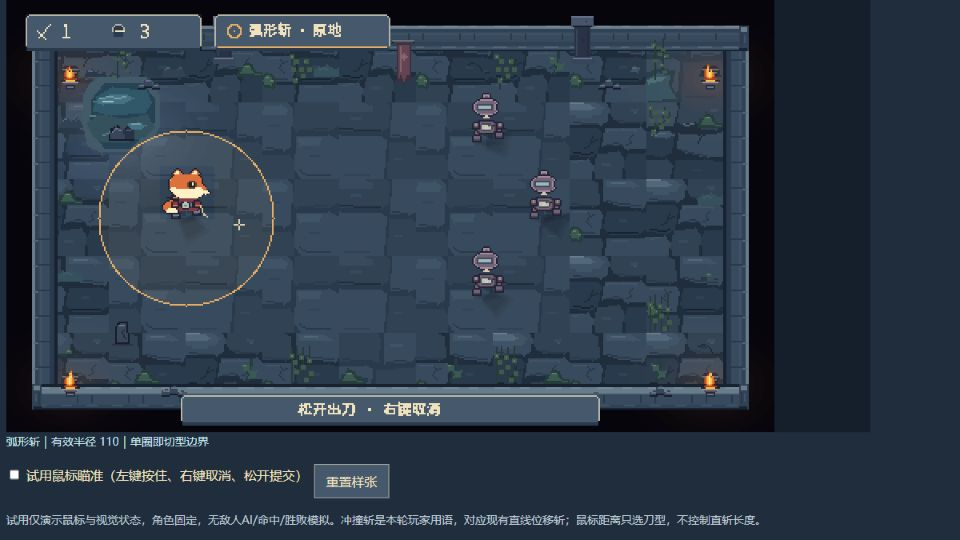
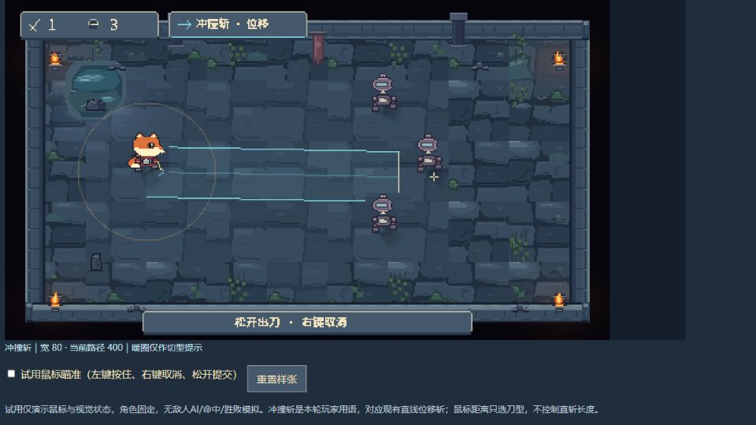

# 双刀型瞄准 UI 设计验证

2026-09-29创建，2026-09-30更新。状态：**R3与双刀型瞄准UI设计方向已获用户认可，尚未接入Godot。** 最新要求为“OK，你继续把剩余问题罗列，确定后继续制作并替换资源”；剩余收口项见 [制作前清单](Production_Readiness_2026-09-30.md)。认可不包含下述未达标头像草稿。用户同时提到弧形斩与冲撞斩。本文将“冲撞斩”作为样张玩家用语，对应现行直线位移斩，不重命名正式GDD，不新增碰撞伤害机制。

交互样张：[Aiming_Review_2026-09-29.html](Aiming_Review_2026-09-29.html)。使用同目录JS绘制，自带弧斩、冲撞斩、斜向、碰墙、跨界、取消、提交按钮及鼠标试用。

## 设计改动

| 信息 | 视觉设计 |
| --- | --- |
| 当前刀型 | 左上HUD旁放小型刀型签；“弧形斩 · 原地”配暖色圆形图标，“冲撞斩 · 位移”配冷色直线图标；不依靠颜色单独区分 |
| 弧形斩 | 脚底为圆心，单个连续像素阶梯暖边，极淡内填面；无第二外圈、方向箭头、扇形扫面或虚构蓄力 |
| 冲撞斩 | 冷青矩形路径、较暗方向轴、起点附近小方向折角，终点为完整平直短横；长度不跟鼠标远近伸缩 |
| 回圈提示 | 冲撞斩时保留同半径无填充弱暖圈，透明度0.12～0.24、1.6s呼吸；明显弱于真正攻击路径 |
| 切型反馈 | 仅跨界时同一边界短亮0.18s，不扩大半径，不重复触发；既有切型轻音在游戏接入阶段保留，本网页无音频 |
| 底提示 | “松开出刀 · 右键取消”；同R3哑光灰蓝细边，取消/提交后转回对应状态，不恢复长期教学文字 |
| 余刀 | 瞄准与取消后为1；提交后为0，可编辑范围预览撤去；不加命中目标预判高亮或新伤害信息 |

## 像素规格与来源

- 设计画布480×270，对应世界960×540，主交互画面严格2×显示；旁边的缩略对照只供比较。新范围/按钮/图标按整数像素单点与直线绘制，没有AI生成图像素化。
- 新UI面板用R3灰蓝底、1原生像素细边、米白文字，无铆钉、渐变、花饰和钢角。范围填面/呼吸允许独立透明度，这是提示层，不是角色源图规则。
- 文字使用项目已授权NotoSansCJKsc字体，在样张中转成硬边显示；它不是自创像素字体。实际中文小字号读感仍待用户审阅，正式接入保留可编辑文本。
- 背景使用现存 `output/environment_pixel_level_01.png` 作为只读占位，并为角色恢复局部遮挡；其中地面和旧狐狸并非本轮认可的正式新美术。不能将此合成设计页当作新场景运行证据。
- 当前level01的Player根位置为(224,272)，也是图集脚底世界锚；样张原生O=(112,136)，R=55，对应110世界像素。冲撞斩原生宽40、最大长200，对应80×400世界像素。
- 切型距离严格小于R为弧斩；等于/大于R为冲撞斩。截图中把预览画在狐狸胸口的做法不采用。
- 网页碰墙演示使用矩形边界并减8原生像素安全距，**不是Godot TileArena射线查询**，也不覆盖全部地形、目标碰撞、零方向和宽度容错。正式接入必须直接消费游戏已有参数和实际截断结果。

## 状态与检查结果

- 浏览器检查：弧斩/冲撞斩显示正常；直线样例显示宽80、路径400；左墙样例截短为176（网页示意值）。
- 取消样例显示余刀1、预览撤去；提交样例显示余刀0、预览撤去。网页鼠标左键松开提交已实际验证，控制台未见错误；JS语法检查通过。
- Coding只读审查：脚锚、2×规格换算、严格边界切型、右键取消后松左键不提交的代码路径符合设计；失焦会取消尚未提交的样张瞄准。左右键组合取消尚未在Godot实玩验证。
- 尚未验证：Godot接入、WASD移动中预览、敌人移动/实际命中、全部地形边界、真实视口缩放、未知规则玩家的理解。网页不模拟这些功能，也不写入项目运行状态。
- 两张截图是浏览器审批留档；查看精确原生图形请用网页，不以浏览器截图压缩后的像素判断源稿质量。

## 头像与组件进展

Art另在 `assets/art/concepts/native_review_20260929/portrait/` 原创绘制48×48头像静态样张，有整数网格绘制源及严格2×/4×PNG。硬边与放大一致性检查通过，但主控认为白颊连片与眼神仍不足以承接E概念，**不推荐将此样张视为头像定稿或铺量依据**。附在网页折叠区，避免与主要瞄准方案混为一项批准。

网页另有五态按钮原生样张，按下态压暗且下移1原生像素。它验证R3减少按钮细节的方向，不改变已认可菜单入口。

## 分工与后续

Art负责头像静态草案；Architecture负责双刀型的信息与误读评审；Coding负责脚锚、几何与样张逻辑只读复核；主控完成网页像素渲染、状态验证与整合。

本轮未改Godot场景、游戏脚本、正式资源引用、GDD/TDD，未清理旧资产，未执行Git写入。双刀型瞄准设计已认可，剩余问题清单确认后再交接正式制作与接入；不能因样张可交互就声称游戏功能完成。

建议将本轮文件单独作为设计样张范围保留，后续提交说明可用 `docs(art): prototype pixel aiming UI for both slash modes`，本轮不执行提交。
