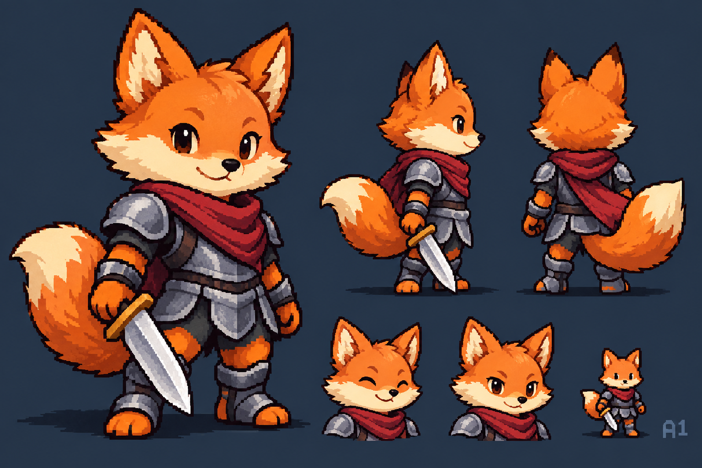
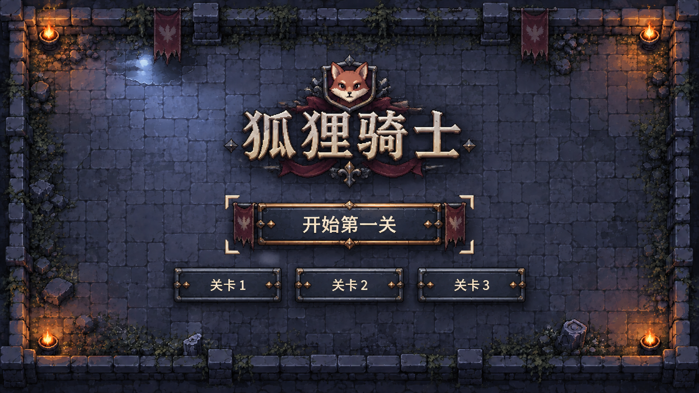
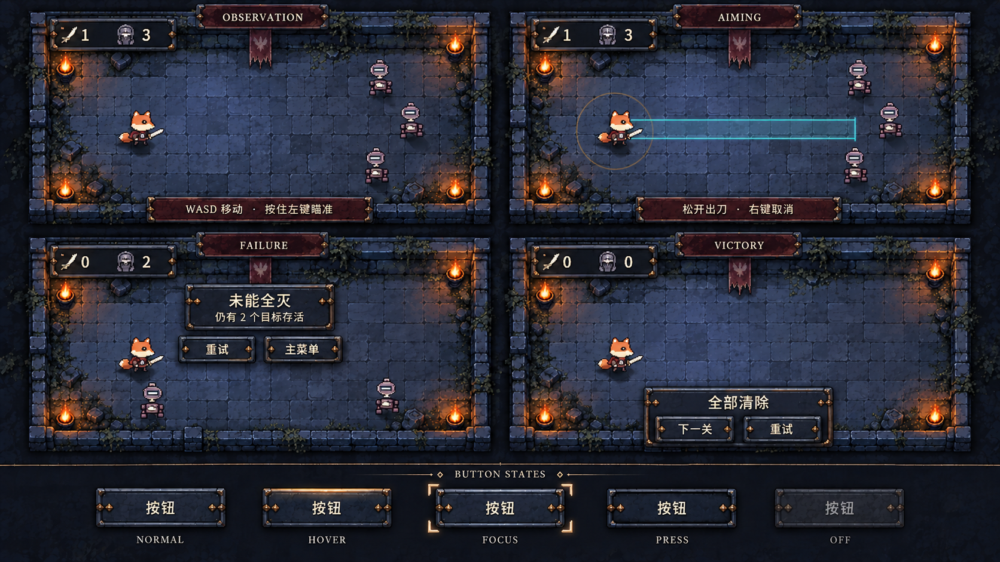

# 狐狸与UI设计修订 R2

2026-09-28。**设计审批阶段。没有制作完整游戏资源、接入场景或执行清理。**

## 1. 本轮状态

- 已认可：统一色板、三关地编、水与光影；保持真值的双刀型演出与110半径重绘。保留上一版方案，不据此提前制作。
- 未通过：新D狐狸。上一版HTML矢量结构图没有解决造型美感，用它批准像素角色的依据不足。
- 返工：菜单/HUD/提示/结果。上一版只是信息布局，缺少与庭院、骑士服装共用的材质、轮廓和装饰体系。
- 新候选：狐狸E造型概念，以及“冷石、钢角、旧铜、酒红布”的完整UI材质方向。均待用户确认。

## 2. 狐狸E：先解决形象，而非靠像素化修饰D

推荐保留的造型结构：略带倾斜的圆润头部、饱满但不整齐的颊毛、向短吻收拢的奶油白面部、小鼻、带眼睑的机敏眼睛；耳根和额毛有体积。围巾、肩甲、手、尾巴分别形成清楚前后层次；站姿有轻微重心变化，不再是对称圆头配直筒身体。

服装仍是酒红围巾、轻钢甲、短银剑；亲和与骑士感并存，不加入剧情身份或新装备系统。待机可短笑，移动与瞄准保持注意力。

**主控自评与取舍：**本图比D更能传达角色魅力，但仍是一张高细节概念板；双肩与腿甲偏多、毛面细碎、眼睛高光较丰富。原生像素设计时应保留轮廓/面相/围巾/大尾四个识别点，将盔甲收为少量大块，毛面收为2～3阶色团；不能逐项照搬细节。左右视图持剑关系也需在四向原生稿中统一。

不再提前锁死头宽16～18像素等几何数字。上一版32×36画布作为候选，不因现有播放器方便就强行塞满或压扁造型。保持原生1px=世界2px的方向；最终画布与实体占屏大小要用原生静态样张和士兵同框确定，不能靠更大角色换取细节。

动作意图保留：四向待机、走停、原地/移动瞄准、取消、直斩、原地弧斩与斩后。**本图没有证明任何完整动画已成立**，此前建议帧数也不是逐帧审美通过。

## 3. UI：与庭院同一套材料，而非单纯增加装饰

推荐“庭院铭牌”方向：冷青灰石面是底，暗钢角件承重，旧铜只在连接和受光处点缀，酒红布集中在标题与主入口附近。材质对应场景石墙、狐狸钢甲和围巾；不靠一整圈高亮金框获得存在感。

| 层级 | 具体设计 | 统一要求 |
| --- | --- | --- |
| 菜单背景 | 延续庭院轮廓、冷光湿石与外围暖火；中心安静，避免大块纯黑空洞 | 只是独立菜单美术，不改变已认可地编、不把概念背景当游戏整张底图 |
| 标题/徽章 | 狐狸徽章与“狐狸骑士”字标成为一组；浅象牙字、暗投影、克制金属连接 | 字形完整，不用碎刀痕破坏文字；徽章随后按获批狐狸统一，目前图中仍偏尖脸须修 |
| 主按钮 | 石面凹槽+暗钢角件+少量旧铜铆点；主操作两侧短布片 | 主入口明显但不靠不停闪光；副入口沿同样材料简化 |
| HUD | 小型双槽徽牌，刀+1/0、头盔+存活数；内面干净 | 只借菜单角件/线宽/受光方向，不把大菜单饰框缩成小HUD |
| 提示 | 暗酒红短布条或窄镶条，文字区无纹理干扰 | 延续短显/提交隐藏，不能因装饰完整而恢复常驻说明 |
| 结果 | 小型同材质铭牌，标题、原因、按钮三级 | 不把游戏画面变成大中央弹窗；按幸存者避让，保留脚底与空间关系 |

菜单图中的纹章花饰只作造型纹理，不代表阵营或故事。最终减少重复菱形钉件和金属花饰，避免“丰富”变成每个角都发亮。

## 4. 同体系多状态样稿

本图覆盖观察、瞄准、失败、胜利与按钮五态，用于比较材质及层级。**画面不是当前运行截图，也不是精确像素或布局验收。**

- 同一冷石面、左上受光的钢边、哑铜连接点，贯穿菜单、HUD和结果。像素边框计划以1原生像素主线和2～3阶材质分面绘制；正文保留可编辑中文字体，实际读感需与像素边框配合核查。
- 按钮：normal稳定暗面；hover上缘提亮一阶；focus独立角标；pressed凹入并压暗内面；disabled去亮边且降低对比。静态生成稿中pressed差异仍不足，不能作为该态最终样张。
- 失败示意把结果放到上方，为下方两名幸存者留空间；最终仍按上一版“上下择位、必要时拆为紧凑块”的设计，并检查角色外围8世界像素安全边距。无可行位置就修布局，不用数字替代目标可见。
- UI概念板保留旧角色作为位置占位，不是重新批准旧狐狸；最终角色只能来自新批准稿。
- 图中OBSERVATION/AIMING/FAILURE/VICTORY和BUTTON STATES是审图标签，不进入游戏常驻界面。
- 瞄准示意已经移除生成的“断续光点+目标球”，但其圆心/矩形起点仍只是概念近似。实际必须取脚底世界位置及现有真实几何参数；本次不改已认可的范围/刀型方案。
- 中文字形、字体大小、图标实际格数、五态差异、纹理噪点尚需原生样张检验；不得把高分辨率生成图的锯齿等同于统一逻辑像素。

## 5. 本轮能判断什么

现在可以审批：狐狸整体长相、气质、服装轻重；UI的材质、装饰程度和它与庭院的整体关系。

现在不能宣称：狐狸缩到游戏尺寸后已经好看、UI已经达到真像素交付门槛、整套状态已经接入、已解决所有遮挡或动态问题。

造型方向通过后，下一项设计验证应是**原生静态角色样张+960×540同框+原生UI角件/按钮/HUD样张**。这些是量产前的设计证据；未过样张审查，不铺整套角色动画与正式UI资源。仍遵守用户“全部待设计项目通过后再执行”的要求。

## 6. 文件与来源

三张图使用内置imagegen，由已有本项目狐狸身份稿、第一关氛围稿和实际截图提供参考。没有引入新第三方游戏素材。完整提示词见 [PROMPTS](../../assets/art/concepts/review_20260928_r2/PROMPTS.md)。原生成文件保留，项目候选副本位于 `assets/art/concepts/review_20260928_r2/`，未被任何生产场景引用。

本轮实际委派 Art 做造型/材质评审，Architecture做信息层级/遮挡约束复核；主控生成并检查概念稿、修订审批状态。没有新增角色代理模型配置，没有生产代码修改或Git操作。
