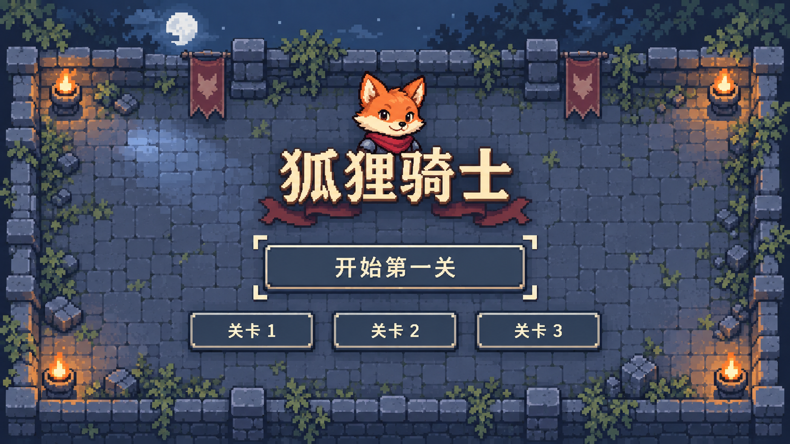
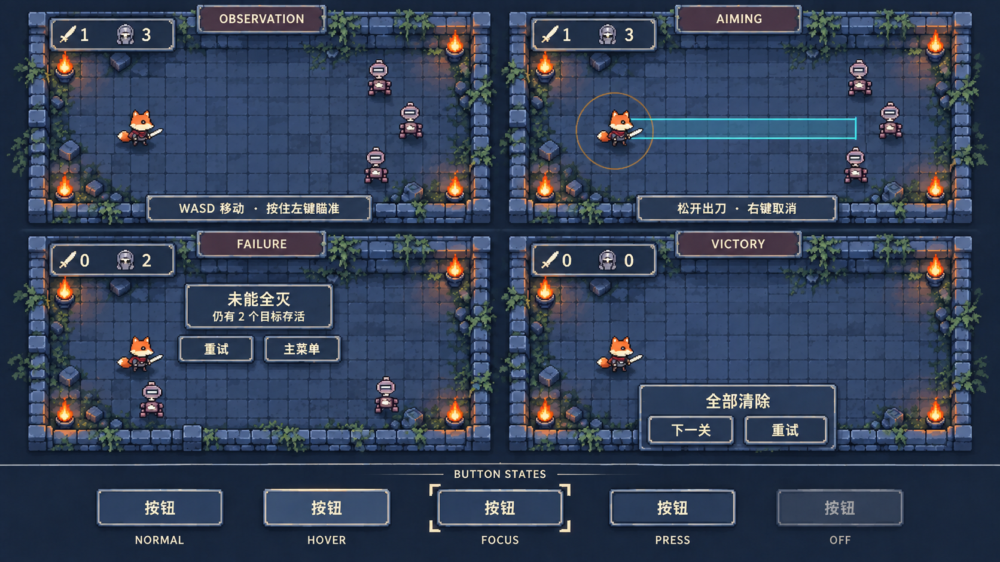

# UI 修订 R3：减轻材质，统一狐狸，明确像素设计

日期：2026-09-28；审批状态更新于2026-09-30。状态：**R3设计方向已认可，未接入游戏。** 双刀型瞄准补充方案亦已认可；当前剩余事项以 [制作前清单](Production_Readiness_2026-09-30.md) 为准。下文候选图与技术缺口说明保留，不代表正式资源验收已通过。

用户反馈：其他没有问题；R2界面太钢铁、黑暗，按钮细节过多；头像应与狐狸设计结合，界面本身也须像素风。

因此保留已认可的环境、双刀型及狐狸E造型方向。本次不再重开角色设计或改变玩法；E的原生像素落地和动画仍需设计样张验证，不把方向认可等同于资源验收。

## 1. 这次具体改动

| 内容 | R3设计 |
| --- | --- |
| 材质 | 哑光灰蓝表面、米白文字、低对比暖灰边；去掉黑钢板的压迫感与金属高光 |
| 按钮 | 删除铆钉、钢角、菱形钉件、挂布和多层装饰框；一层细边加轻底影，中心留白 |
| 标题 | 完整米白像素字、轻微暖暗投影；降低浮雕和镀金质感 |
| 狐狸头像 | 取E的高耳、橙额、圆奶油颊、短吻小鼻、机敏眼和酒红围巾，作为头肩像；撤掉盾徽、皇冠与尖脸标志 |
| 点缀 | 酒红只少量服务标题与角色身份；火光仍在边缘，不将整套UI变成明亮童话风 |
| HUD/结果 | 继承同样的哑光灰蓝细边，字和图标先读到；保留既定短提示与结果避让，不靠装饰增加常驻信息 |

## 2. 菜单样稿

菜单头像已经参照E重新设计，不再使用R2的钢盾尖脸。它仍是候选像素表现，最终原生小像必须和获批角色四向稿对照，不能分别发展两张脸。

菜单背景被生成器稍作构图调整，出现远景月亮与树影，仅作为菜单候选背景；**不用于改动已认可的三关地编、镜头或光源**。本次主要审批UI轻重、按钮简化与头像关系，不以背景变化倒推关卡要求。

## 3. UI家族样稿

四种状态与按钮五态共用同一视觉语言。观察/瞄准/失败/胜利英文是审图标签，不进入常驻游戏界面；旧狐狸仅是位置占位，正式角色采用E方向。圆心、范围和目标位置为示意，真实几何仍沿用已认可方案与脚底世界坐标。

五态最终设计：normal平整底色；hover提亮一阶；focus两个小角标；pressed内面压暗且内容下移1原生像素；disabled降低对比且去掉亮边。生成图中的pressed差异仍偏弱，不能作为该态最终验收。

## 4. 像素设计规格

不是先画高分辨率金属界面再加像素滤镜。拟制作样张从原生格设计：

- 主按钮原生120×27、2×显示；主边1原生像素，底影1原生像素，角部最多2像素阶梯切角；不再增加内外多圈描边。
- HUD底板以原生九宫格设计，图标16×16原生；菜单、HUD、结果共用主边像素宽度与用色规则。
- 每种表面只保留底色、亮边、暗边三阶；硬边透明度0/255。纹理只在边缘少量成组，不使用噪点、渐变、模糊投影。
- 头像以约48×48原生小像作为设计样张起点，眼、短吻、两团白颊必须在原生尺度可辨；不将E概念大图直接缩小。尺寸需与标题同框后锁定，不反向影响游戏角色体量。
- 标题、图标、数字保持像素字块；正文和按钮中文优先可编辑文本，字号与基线按像素格对齐并实际检查，不能因强调像素感牺牲汉字可读性。
- UI调色目标：灰蓝底 `#45586C` / 较浅悬停 `#566D80`，暗边 `#2A394C`，细边 `#B8B6A6`，正文 `#F0E2BD`，点缀酒红 `#754951`。这些是待制作设计色，不是生成图精确取样。

当前图片已经朝明显像素色块/阶梯轮廓修订，但生成器仍残留少量平滑明暗、角件和不均匀细节。**不能将它们当成通过原生网格检查的PNG资源。** 方向通过后，要用上述原生按钮、头像、HUD静态设计样张验证，再进入整套制作。

## 5. 边界与来源

仅新增设计候选与修订记录，更新审批入口；不改场景、脚本、正式资源引用、玩法文档，不清理旧资源。Art 实际参与只读材质/像素约束评审；主控生成与检查样稿。

使用内置imagegen，以R2菜单/状态板和E角色为参考，完整提示词在 [PROMPTS](../../assets/art/concepts/review_20260928_r3/PROMPTS.md)。原生成图保留，候选副本位于本项目concepts目录。
